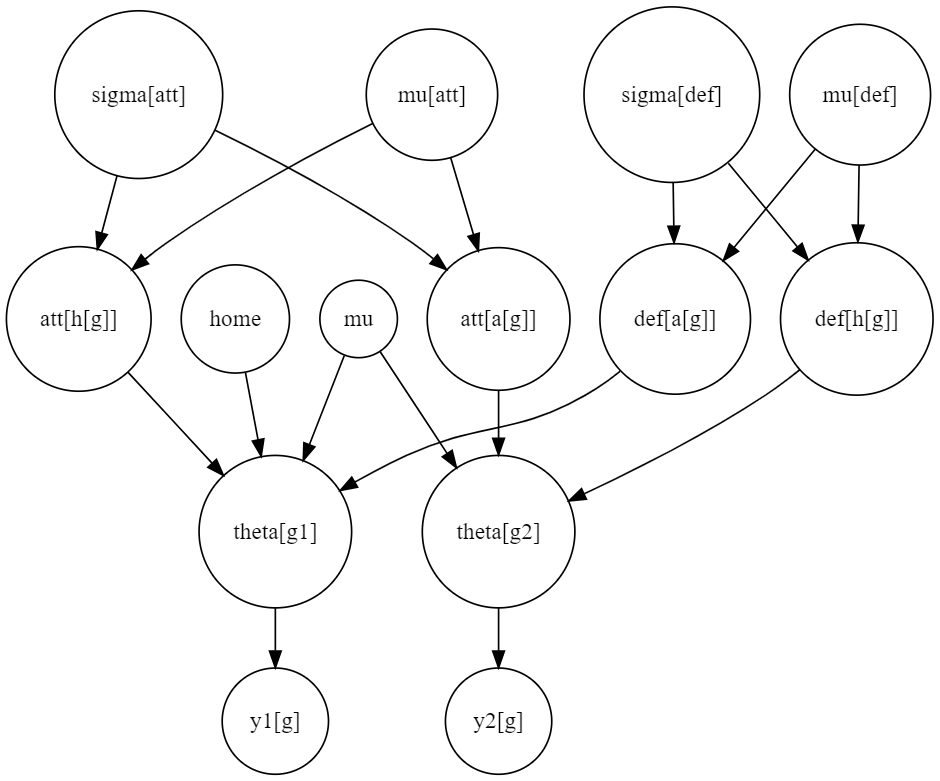

# soccer_categorical_model

This model was developed using Bayesian statistics. The main idea of the project is to apply the model to football. The model creates a latent variable that can classify the game into three classes—loss, draw, and win using the home team as a reference. Throughout this project, I developed skills in Bayesian inference and the ability to generate synthetic data.

## Data
Initially, the input data for the model is a league table. The data required for running this model follows this order: 

$K\$ -> number of classes , in this case it will be 3, as the classes are defeat, draw and victory;

$G\$ -> number of matches,table length;

$T\$ -> number of teams;

$h\$ -> home team; 

$a\$ -> away team; 

$y_1\$ -> number of goals scored by the home team;

$y_2\$ -> number of goals scored by the away team; 

$R\$ -> match result with the home team as the reference (1 for home team loss, 2 for draw, and 3 for home team win). With this data, the execution begins.

## Model Equation

Firstly, the attack and defense effects for each team are calculated using a poisson_log model, which takes the following form:

y1[g] ~ Poisson_log($\mu\$ + $home\$ + att[h[g]] + def[a[g]])

y2[g] ~ Poisson_log($\mu\$ + att[a[g]] + def[h[g]])

